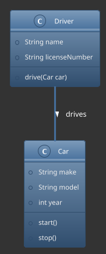
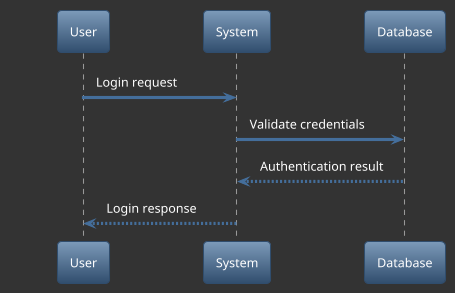
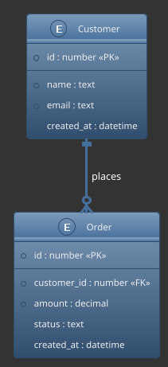

# @brainstack/plantuml-mcp

[](https://www.npmjs.com/package/@brainstack/plantuml-mcp)
[](https://opensource.org/licenses/MIT)

A Model Context Protocol (MCP) server for generating UML diagrams using PlantUML. This package enables AI assistants to create professional diagrams from text descriptions through the MCP standard.

## Features

- **Easy Diagram Generation**: Create UML diagrams from PlantUML code
- **Multiple Output Formats**: Generate diagrams in PNG, SVG, or text formats
- **Automatic Branding**: Adds a customized footer to all diagrams
- **MCP Standard**: Compatible with the Model Context Protocol for AI tools
- **Dark Theme Support**: Works well with dark-themed diagrams

## Installation

### Using npm

```bash
npm install @brainstack/plantuml-mcp
```

### Using the pre-configured scripts

1. Clone the repository:
   ```bash
   git clone https://github.com/mouimet-infinisoft/augment-code-mcp.git
   cd augment-code-mcp/plantuml-mcp
   ```

2. Make the run script executable:
   ```bash
   chmod +x config/run-plantuml-mcp.sh
   ```

3. Run the MCP server:
   ```bash
   ./config/run-plantuml-mcp.sh
   ```

## Configuration

### Environment Variables

Create a `.env` file in your project root with these options:

```
# Optional: Custom PlantUML server URL
PLANTUML_SERVER_URL=https://www.plantuml.com/plantuml
```

### Configuration Files

The package includes pre-configured files in the `config` directory:

- `mcp-config-plantuml.json`: MCP server configuration
- `run-plantuml-mcp.sh`: Script to run the server
- `mcp-config-plantuml-wsl.json`: Configuration for WSL environments

### Custom Server Configuration

If you're using the package programmatically, you can configure the server:

```javascript
const { createServer, startServer } = require('@brainstack/plantuml-mcp');

// Create a server with custom PlantUML URL
const server = createServer({
  plantUmlServerUrl: 'https://your-custom-plantuml-server.com'
});

// Start the server
startServer(server);
```

## Usage with Augment Code

1. Install the Augment Code extension for VSCode
2. Run the PlantUML MCP server using the provided script
3. Configure Augment Code to use this MCP server:
   - Open VSCode settings
   - Search for "Augment Code MCP"
   - Add the PlantUML MCP server configuration
4. Generate diagrams using natural language in VSCode

## Usage with WSL 2 (Windows)

For Windows users with WSL 2:

1. Use the WSL-specific configuration file:
   ```bash
   cp config/mcp-config-plantuml-wsl.json config/mcp-config-plantuml.json
   ```

2. Run the server from your WSL environment:
   ```bash
   ./config/run-plantuml-mcp.sh
   ```

3. Configure Augment Code to connect to the WSL endpoint

## Diagram Examples

### Class Diagram



### Sequence Diagram



### Entity Relationship Diagram



## API Reference

### MCP Tool: `generateDiagram`

This MCP server provides a single tool for generating diagrams:

| Parameter | Type | Description | Default |
|-----------|------|-------------|---------|
| `plantUmlCode` | string | The PlantUML code to generate a diagram from | (required) |
| `format` | string | The format of the diagram: 'png', 'svg', or 'txt' | 'png' |

**Response:**
```json
{
  "url": "https://www.plantuml.com/plantuml/png/...",
  "format": "png"
}
```

## Styling Recommendations

For best results with dark-themed diagrams:

1. Add the spacelab theme:
   ```
   !theme spacelab
   ```

2. Set a dark background:
   ```
   skinparam backgroundColor #333333
   ```

3. Use light text colors:
   ```
   skinparam classFontColor #FFFFFF
   skinparam entityFontColor #FFFFFF
   skinparam sequenceParticipantFontColor #FFFFFF
   ```

4. Add accent colors for arrows and borders:
   ```
   skinparam arrowColor #4285F4
   skinparam classBorderColor #666666
   ```

## Footer Annotation

All diagrams generated with this MCP server automatically include a footer annotation:

```
Generated by @brainstack/plantuml-mcp | [current date and time]
```

This footer is styled with a blue highlight for the package name and a lighter gray for the timestamp.

## Resources

- [PlantUML Official Website](https://plantuml.com/) - For syntax reference and examples
- [Model Context Protocol](https://github.com/brainsteam/model-context-protocol) - For MCP standard details
- [Augment Code](https://augment.dev/) - For integration with VSCode

## License

MIT © [Martin Ouimet](https://github.com/mouimet-infinisoft)
