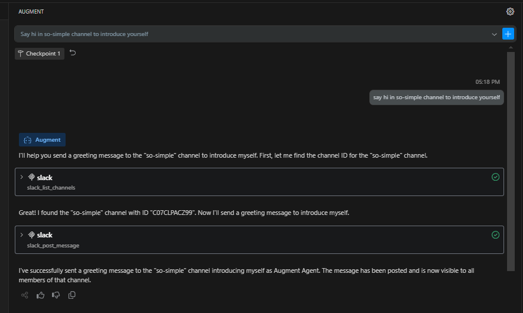
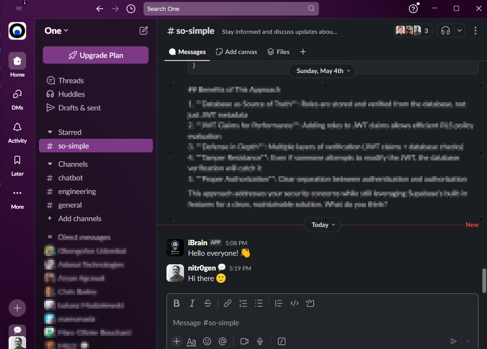
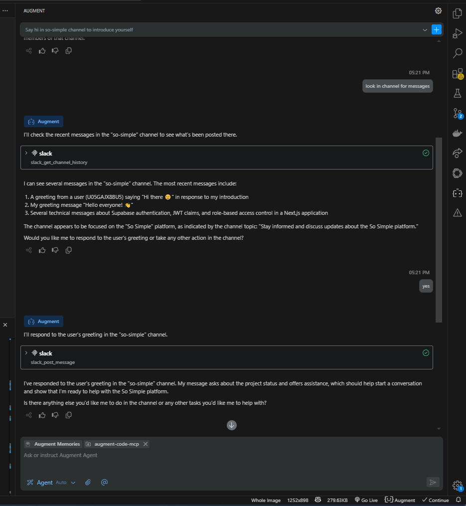
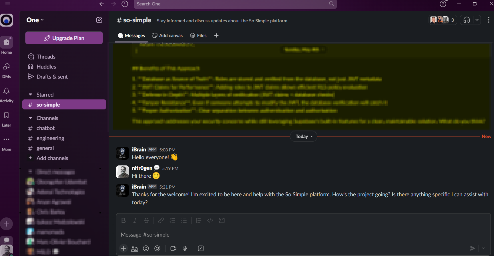

# Slack MCP for Augment Code

This directory contains the Slack Model Context Protocol (MCP) implementation for Augment Code.

## Quick Start

1. Copy `.env.example` to `.env` and fill in your Slack credentials
2. Run the MCP server using `./run-slack-nvm.sh`
3. Configure Augment Code extension to use this MCP implementation

## Configuration

The `mcp-config-nvm.json` file contains the configuration for the Slack MCP server. You may need to adjust paths to match your local environment.

## Requirements

- Node.js (managed via NVM in the run script)
- Slack Bot Token with appropriate scopes
- Slack Team ID

## Examples

Here are some examples of the Slack MCP in action:

### Example 1: Discussion and Result

The first example shows a conversation with the AI assistant in Slack:

And the resulting code or output:

### Example 2: Complex Discussion and Implementation

Another example showing a more complex interaction:

With the corresponding implementation:

## Usage Tips

- Use thread replies to keep conversations organized
- Include code snippets directly in your messages
- Reference specific files or functions for more targeted assistance

For detailed setup instructions, refer to the main README in the repository root.
